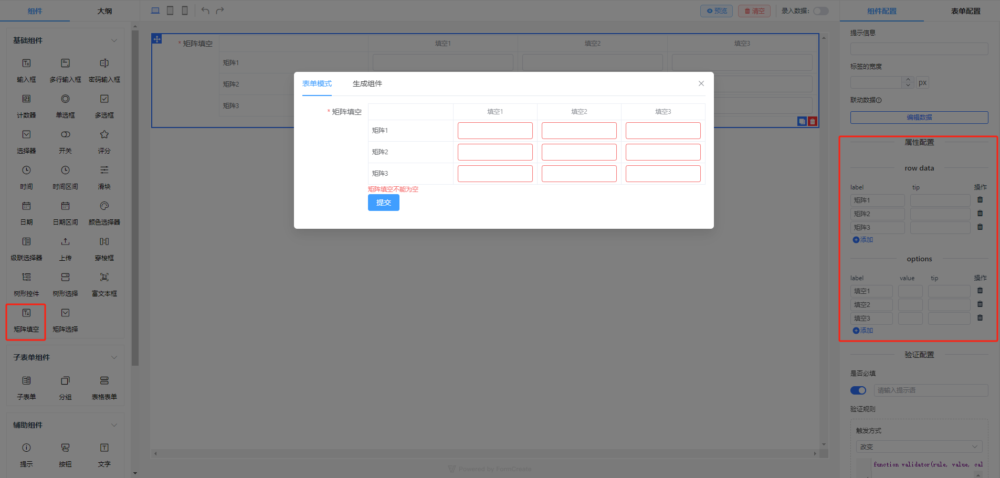
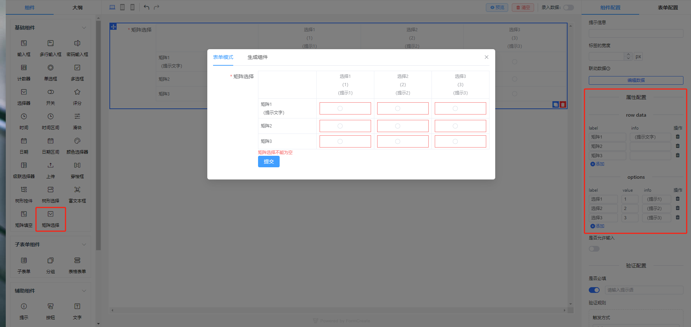

## 平台简介
- 本仓库为前端技术栈 [Vue3](https://v3.cn.vuejs.org) + [Element Plus](https://element-plus.org/zh-CN) + [Vite](https://cn.vitejs.dev) 版本
- 本仓库是基于 [FcDesigner](https://github.com/xaboy/form-create-designer) 实现的自定义表单扩展组件

**FcDesigner 是基于 [@form-create/element-ui](https://github.com/xaboy/form-create) 实现的表单设计器组件。可以通过拖拽的方式快速创建表单，提高开发者对表单的开发效率，节省开发者的时间。**

## 扩展自定义组件以及组件的拖拽规则
- 矩阵填空
- 矩阵选择





## 前端运行

```bash
# 安装依赖
npm install

# 启动服务
npm run dev
```
